# IT 자격증 스터디 플랫폼 : DDAJA-IT

## 📆 프로젝트 기간 

| 날짜 | 업무 내용 |
| --- | --- |
| 2024.5.08 ~ 2024.05.22 | 프로젝트 기획, 주제 선정, 자료 조사 |
| 2024.05.22 ~ 2024.05.30 | 화면 페이지 설계 및 기능 명세서 작성 |
| 2024.06.01 ~ 2024.08.8| 데이터 수집 및 전처리 (Airflow를 사용한 워크플로 자동화) |
| 2024.06.01 ~ 2024.06.15 | 프론트앤드 백엔드 구축 및 API 연동, AWS 인프라 구축 |
| 2024.06.15 ~ 2024.06.20 | CI/CD (Spring Boot, React) |
| 2024.06.20 ~ 2024.06.24 | 문서 작업 및 발표 |

  

## 🕺 구성원

| 구성원 | 깃허브 주소 | 분담 역할 |
| --- | --- | --- |
| 장윤영 | https://github.com/Jyundev | CBT 자격증 시험 데이터 수집 SpringBoot RESTful API 개발  ERD 및 API 설계 Swagger 기반  REST API 문서 자동화 프로젝트 문서화 작업|
| 조하민 | https://github.com/chohaming |AWS 인프라 설계 및 구축 airflow 데이터 수집 자동화 Git Actions 기반 프론트엔드 배포|
| 김도한 | https://github.com/rlaehgks115 |React 기반 프론트엔드 아키텍처 설계 및 개발 S3 기반 백엔드 배포|
| 김백운 | https://github.com/kimbw0615 | 자격증 접수일정,  시험 데이터 수집 자격증 시험 후기 데이터 수집 및 분석 데이터 정제 및 난이도 분석 모델링|

  

## Contents Table

- [프로젝트 개요](#프로젝트-개요)
- [서비스 기능](#서비스-기능)
- [개발환경](#개발환경)
- [데이터](#데이터)
- [아키텍처](#아키텍처)
- [난이도 분석 모델](#난이도-분석-모델)
- [프론트엔드](#프론트엔드)
- [백엔드](#백엔드)
- [시연영상](#시연영상)

## 프로젝트 개요

 

DDAJA-IT 은 "따자 IT 자격증" 의 줄임말로 IT 직군을 희망하는 모든 사람들을 위한 자격증 공부 플랫폼입니다. 

따자잇 팀원들은 자격증 준비에 어려움을 겪었지만, 그룹 스터디를 통해 꾸준히 공부할 수 있었습니다. 
이러한 경험을 바탕으로 비전공자도 쉽게 접근할 수 있는 자격증 공부 플랫폼의 필요성을 느꼈습니다. 
이에 저희 팀은 IT 직군을 위한 IT 자격증 공부 플랫폼을 만드는 프로젝트를 기획했습니다.

1차 목표로 총 10개의 IT 자격증을 기준으로 프로젝트를 진행했습니다.

<table>
    <tr>
        <td>1. 리눅스마스터(1급/2급)</td>
    </tr>
    <tr>
        <td>2. 정보처리기사</td>
    </tr>
    <tr>
        <td>3. 정보보안기사</td>
    </tr>
    <tr>
        <td>4. 정보처리산업기사/td>
    </tr>
    <tr>
        <td>5. 네트워크관리사(1급/2급)</td>
    </tr>
    <tr>
        <td>6. 빅데이터분석기사</td>
    </tr>
    <tr>
        <td>7. SQLD</td>
    </tr>
        <tr>
        <td>8. ADsP</td>
    </tr>
</table>
 

## 서비스 기능 

 

    <table>
        <tr>
            <td>1. IT 자격증 종류별로 필요한 정보를 한 곳에 모아 제공합니다.</td>
        </tr>
        <tr>
            <td>2. 스터디 챌린지 프로그램을 통해 유저들에게 데일리 과제를 제공합니다.</td>
        </tr>
        <tr>
            <td>3. 사용자들 간의 학습률을 비교하여 동기 부여를 높입니다.</td>
        </tr>
    </table>

 

## 개발환경 

- Window11, MacOS, Linux
- JDK 17
- Spring Boot : 3.2.5
- React : 18.2.0
- Docker 25.0.3
- Github Actions
- nginx : 1.27.0
- Mode-js : 20.12.2
- Airflow : 2.9.1
- AWS EC2, RDS, S3

## 데이터 

| 데이터 | 수집방법 |
| --- | --- |
| 자격증별 시험 일정 데이터 | ADsP, SQL 개발자, 리눅스마스터 등 IT 자격증은 큐넷에서 제공하는 자격정보 오픈 API에 포함 되지 않은 민간 자격이 많으므로 사용하지 않고 직접 데이터 수집 | 
자격증별 시험 정보 데이터 |  ADsP, SQL 개발자, 리눅스마스터 등 IT 자격증은 큐넷에서 제공하는 자격정보 오픈 API에 포함 되지 않은 민간 자격이 많으므로 사용하지 않고 직접 데이터 수집 |
| 자격증 시험 후기 데이터| 네이버 수제비 카페의 후기 게시판 게시글을 파이썬을 이용해 자동으로 수집 사용 도구: Python, Selenium, Pandas, AWS S3 |
| 자격증별 시험 문제 데이터 |ADsP, SQLD, 빅데이터분석기사 :  네이버 수제비 카페의 기출문제 데이터를 파이썬을 이용해 자동으로 수집  네트워크관리사, 라눅스마스, 정보보안기사, 정처기, 정처산기 : 전자문제집 CBT 사이트의 기출문제 PDF 파일을 파이썬 패키지(Spire.PDF,PyMuPDF) 를 이용해 문제 추출  |

## 아키텍처

### Backend-Frontend

 

1.  Spring Boot와 React를 백엔드와 프론트엔드로 각각 사용하여 VSCode를 이용해 코드를 작성

2. 코드가 GitHub에 푸시되면 GitHub Actions 파이프라인이 실행

3. CI/CD 파이프라인이 애플리케이션을 빌드하고 테스트

4. Docker 이미지가 생성되어 Docker Hub에 푸시

5. 배포가 EC2 인스턴스로 진행죄며, Nginx가 백엔드의 다른 버전(블루와 그린) 간의 라우팅을 관리

6. 프론트엔드 코드는 S3에 업로드되고 CloudFront를 통해 전달

7. Route 53은 DNS를 관리하며 프론트엔드는 CloudFront로, 백엔드는 Nginx로 트래픽을 라우팅

8. 배포 상태 및 기타 알림이 Slack으로 전송

### DATA

주기적으로 이루어져야 하는 데이터 수집 과정을 pipeline를 통해 자동화 하기 위해 airflow 사용 

#### DAG1 자격증 시험 후기 크롤링 
목적
- 난이도 분석을 위한 자격증 시험 후기 데이터 수집

작업 설명

1. 게시글 선택 및 데이터 추출
    - 자격증 후기 페이지에서 게시글을 선택하고 데이터 추출 작업을 반복 실행
2. 데이터 수집
    - BeautifulSoup을 이용하여 데이터 수집 
    - 네이버 카페(수제비)에서 자격증 시험 후기 데이터를 수집하기 위해 로그인이 필요.
3. 데이터 저장
    - 수집한 후기 데이터를 CSV 파일로 변환 후 S3에 저장
4. 알림 발송
    - 슬랙으로 데이터 수집 결과를 알림

#### DAG2 기출문제 추출 
목적

- 자격증별 챌린지 파트별 기출문제 제공을 위한 문제 데이터 수집

작업 설명

1. 데이터 갱신 확인

    - S3의 기출문제 폴더에 있는 PDF 파일을 전주와 비교하여 데이터가 갱신된 경우에만 데이터 수집.

2. PDF 파일 읽기
    - S3에 저장된 PDF 파일을 읽음

3. 텍스트 데이터 추출
    - Spire.PDF를 이용하여 텍스트 데이터(문제와 보기)를 추출
4. 이미지 추출
    - PyMuPDF를 이용하여 PDF 파일을 HTML로 변환하고, 보기에 포함된 이미지를 추출.
    - 추출한 이미지는 S3에 저장 후 링크를 추출.
5. 데이터 저장
    - 추출한 기출문제 데이터를 CSV 파일로 변환 후 S3에 저장
6. 알림 발송
    - 슬랙으로 데이터 수집 결과를 알림

 

>데이터 수집 결과 알림

    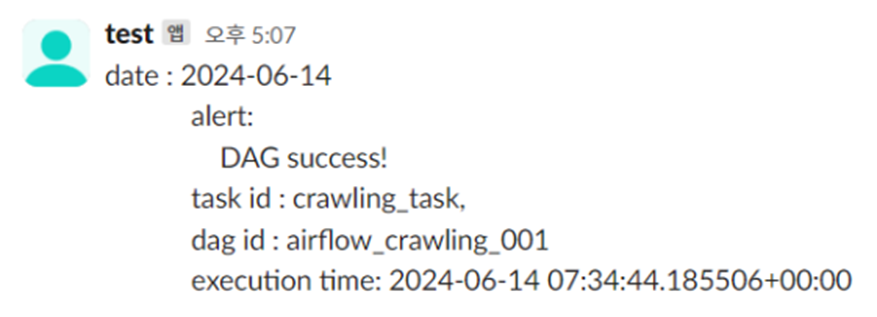
    

## 난이도 분석 모델
GPT-4 API를 활용하여 정보처리기사 시험 후기 데이터를 분석하여 각 과목의 난이도를 평가했습니다. GPT-4 모델 특징으로는 자연어 처리에 최적화된 최신 모델이며, 다양한 텍스트 분석 및 생성 작업에서 뛰어난 성능을 보입니다.

    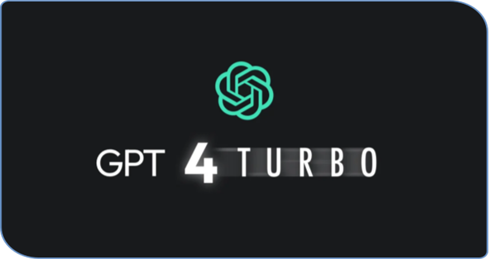

 

### 모델 사용 이유
1. 유연성: GPT-4 API는 다양한 형식의 입력을 처리하며, 요구에 맞는 다양한 형태의 출력을 생성 가능하며, 이는 다양한 데이터 형식을 다루거나 다양한 질문에 대응하는 데 유리합니다.

2. 고급 텍스트 이해 능력: GPT-4 API는 복잡한 문장을 이해하고, 문맥을 파악하여 적절한 답변을 생성할 수 있는 능력을 갖추고 있습니다. 

 

>난이도 분석 코드와 입력데이터

    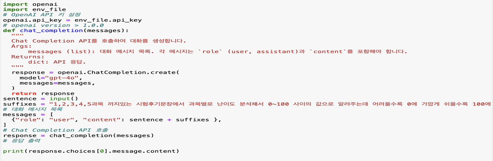
    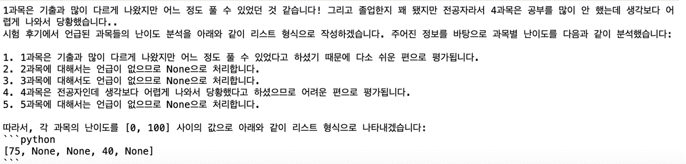

 

데이터 준비 
- 수집된 시험 후기 데이터를 CSV 파일로 저장  Pandas 라이브러리를 사용하여 DataFrame 형태로 로드

난이도 분석

-  각 시험 후기에 대해 OpenAI의 GPT-4 모델을 사용하여 과목별 난이도를 분석
- 입력된 문장으로부터 과목별 난이도를 0에서 100 사이의 점수로 평가

응답 처리

- 모델의 응답으로부터 과목별 난이도 점수를 추출하여 DataFrame에 추가
- 각 과목에 대해 난이도 점수를 리스트 형식으로 저장

 

>난이도 예측 결과

    

 

모델의 과목별 난이도 예측 결과에 따르면, 4과목이 가장 어려운 과목으로 판단되었고, 실제 시험 결과에서도 4과목과 5과목의 점수가  가장 낮게 나왔습니다.

## 프론트엔드 

사용자 인터페이스(UI)를 만들기 위해 사용되는 자바스크립트 라이브러리 **React** 르 이용하여 프론트엔드를 개발했습니다.

 

### 메뉴트리 

    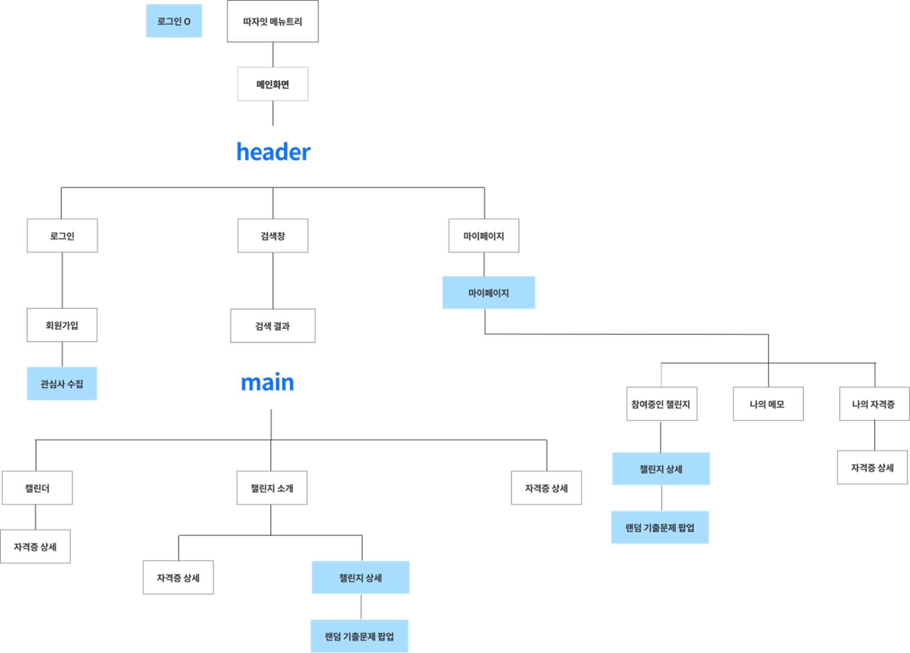

### Flow Chart

    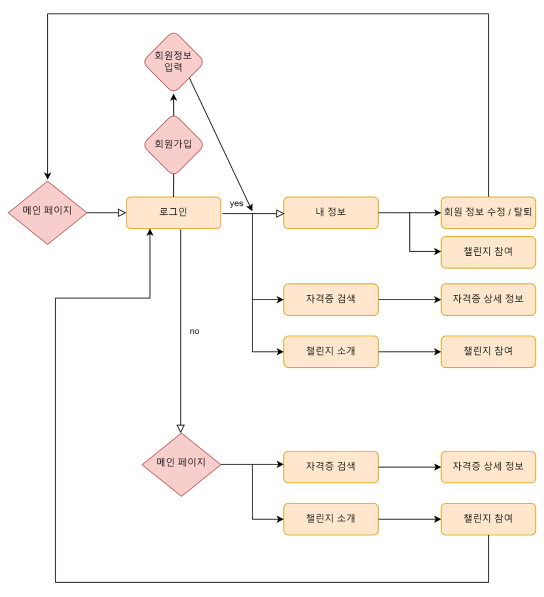

## 화면 설계

> 로그인 & 회원가입 & 사용자 정보 수집 페이지

 

    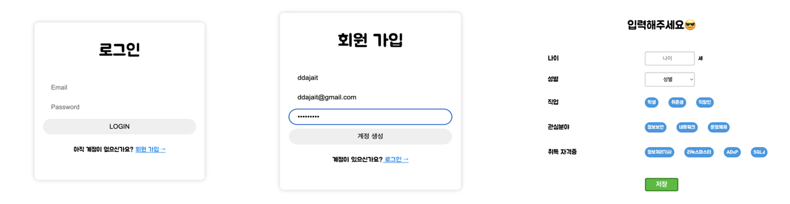

> 메인페이지

 

    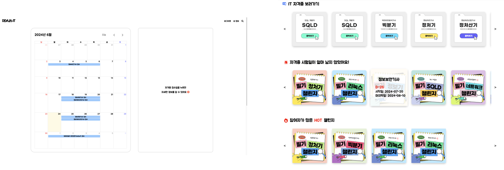

 

> 챌린지 소개 & 챌린지 상세 페이지

 

    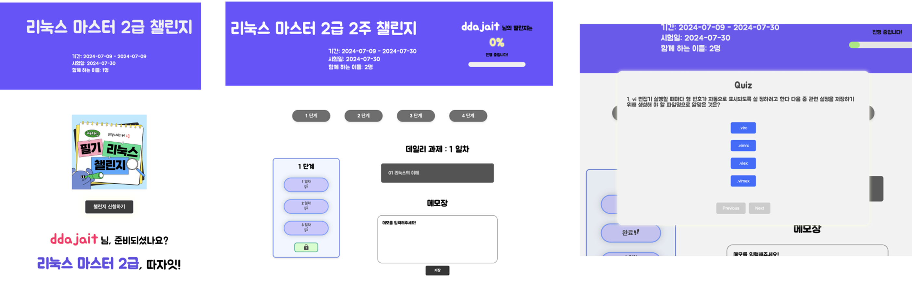

 

>자격증 정보 페이지

 

    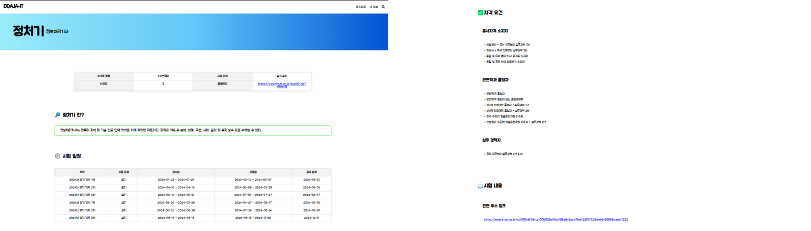

 

>마이페이지

 

    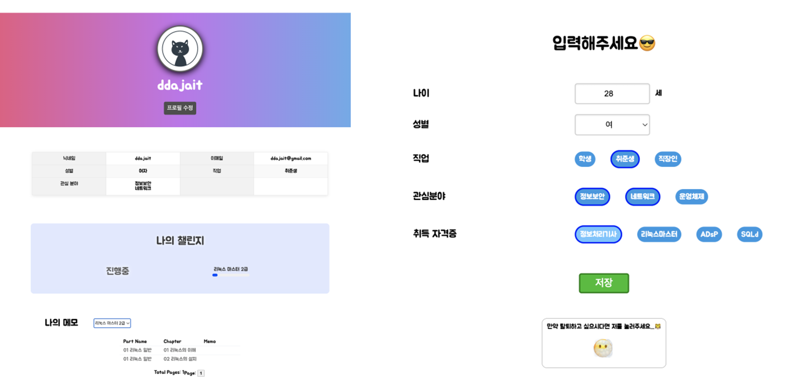

 

## 백엔드 

애플리케이션 개발을 편하게 할 수 있게 해주는 오픈소스 경량급 애플리케이션 프레임워크인 **스프링부트** 를 이용하여 백엔드를 개발했습니다. 

### Swagger 기반 API 문서 자동화

Swagger UI를 이용해 프론트엔드와 백엔드의 협업툴로 사용했습니다. API를 시각화하는 코드가 자동으로 생성되기 때문에, 보다 간편하게 API를 테스트할 수 있습니다.

 

    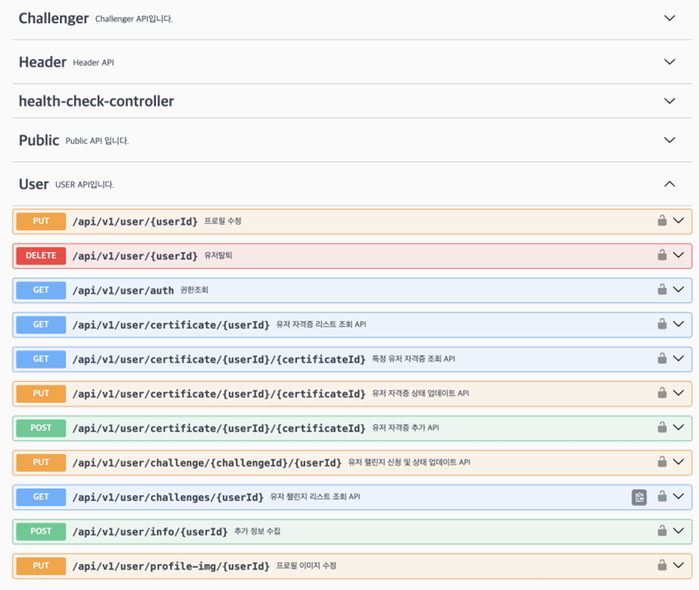

 

### Spring Security 

 SPRING 기반의 애플리케이션의 보안(인증과 권한, 인가 등)을 담당하는 
스프링 하위 프레임워크 Spring Security와 JWT를 사용하여 인증 및 권한 부여를 처리했습니다.

 

    

### JWT 인증 방식 

웹에서 사용되는 Json 형식 기반의 토큰 표준 규격입니다. JWT는 3개의 영역(header, payload, verify signature )로 이루어져 있습니다. 

 

|  | |
| --- | --- |
| HEADER | 토큰의 타입(JWT)과 해싱 알고리즘을 정의합니다. |
| PAYLOAD | 토큰에서 사용할 정보인 Claim을 담고 있습니다. Claim은 JWT를 통해 전달되는 실제 데이터입니다. |
| SIGNATURE| Header와 Payload를 Base64로 인코딩한 값에 서버의 Secret Key를 결합하여 Header에서 정의한 알고리즘으로 해시화한 값입니다. |
|  | |

 

    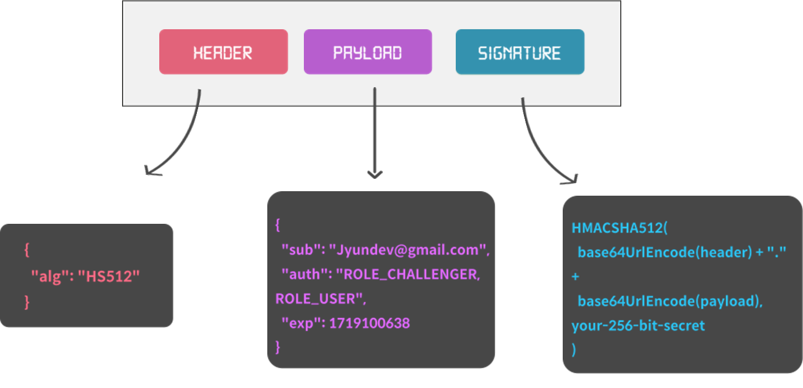

 

#### JWT  인증방식 사용 이유
- **클라이언트와 서버의 독립성**  :  클라이언트가 인증된 상태를 유지하면서도 서버와의 별도 세션 저장소를 필요로 하지 않습니다.
- **무상태 통신 (Stateless)** : JWT는 토큰 자체에 모든 인증 정보를 포함하고 있으므로 서버는 상태를 유지할 필요가 없습니다. RESTful API와 같은 무상태 통신에 매우 적합합니다.

 

    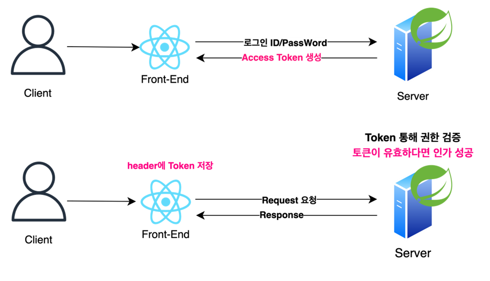

 

## ERD 

DDAJA-IT의 엔티티 관계 다이어그램(ERD)은 총 13개의 테이블로 구성되어 있으며, 주요 도메인으로는 유저, 자격증, 챌린지 관련 테이블로 구분됩니다.

 

    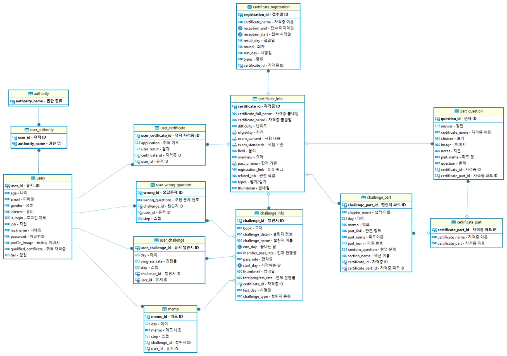

 

## 시연영상
