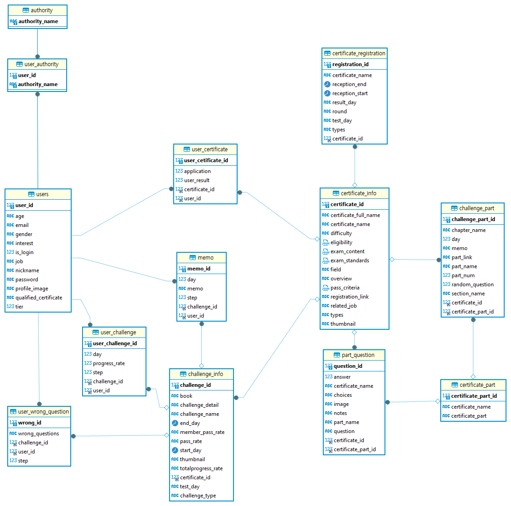
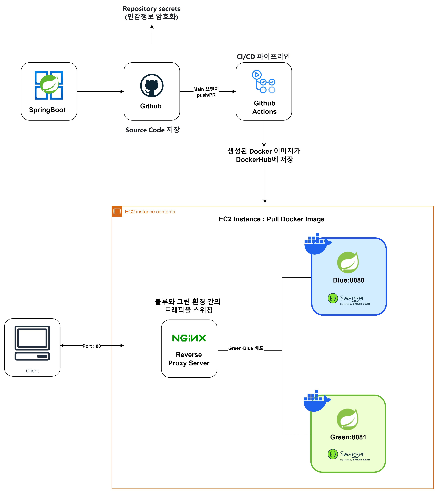
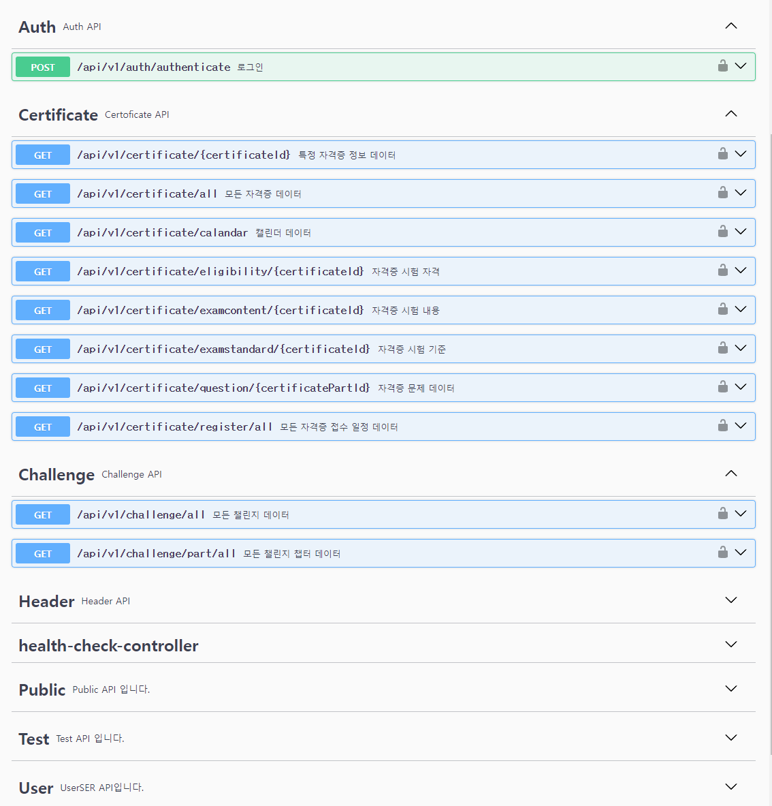

# PROJECT : IT자격증 챌린지 웹사이트 

  

## 📆 프로젝트 기간 

| 날짜 | 업무 내용 |
| --- | --- |
| 2023.04.08 ~ 2023.04.22 | 프로젝트 기획, 주제 선정, 자료 조사 |
| 2023.04.22 ~ 2023.04.30 | 화면페이지 설계 및 기능 명세서 작성|
| 2023.05.01 ~ 2023.05.14 | 데이터 수집 및 AWS 환경 구축|
| 2023.05.15 ~ 2023.06.15 | 프론트앤드 백엔드 구축 및 API 연동|
| 2023.06.15 ~ 2023.06.20 | CI/CD|
| 2023.06.20 ~ 2023.06.24 | 문서 작업 및 발표|

  

## 🕺 구성원

| 구성원 | 깃허브 주소 | 분담 역할 |
| --- | --- | --- |
| 장윤영 | https://github.com/Jyundev | SpringBoot RestFul API 개발|
| 조하민 | https://github.com/chohaming |AWS 인프라 구축|
| 김도한 | https://github.com/rlaehgks115 |React 프론트엔드 개발|
| 김백운 | https://github.com/kimbw0615 | 데이터 수집 및 전처리, 모델링|

  

## Environment
- Window11, MacOS, Ubuntu
- JDK 17
- Spring Boot : 3.2.5
- React : 
- Docker 25.0.3, Docker Compose
- Github Actions
- nginx
- AWS EC2, RDS, S3

## ERD

     
     

##  CI/CD 파이프라인

GitHub Actions CI/CD 파이프라인은 Spring 애플리케이션을 AWS EC2 인스턴스에 Docker를 사용하여 배포하는 환경을 구축

     
     

## Spring REST Docs
###  Swagger - springdoc : 2.5.0
http://52.78.44.47/swagger-ui/index.html#/

     
     

